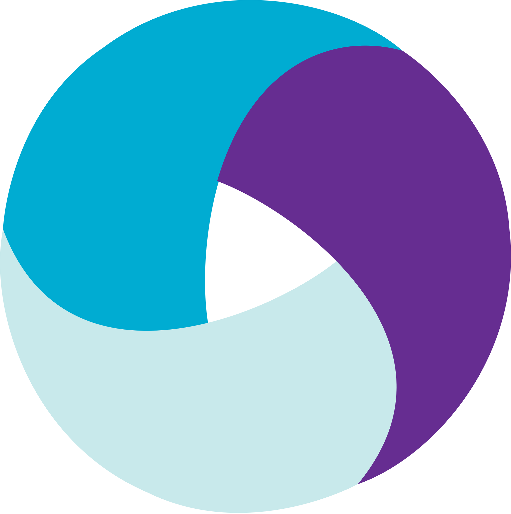

## Hi there 👋 

## About me 
I am an ISTQB-certified passionate QA Test Automation Engineer with 3+ years of experience in Automation with Java.

## Stack:

## 📫 How to reach me: 

    
    
    

                                                                                                                                                                                    

## My Projects 

